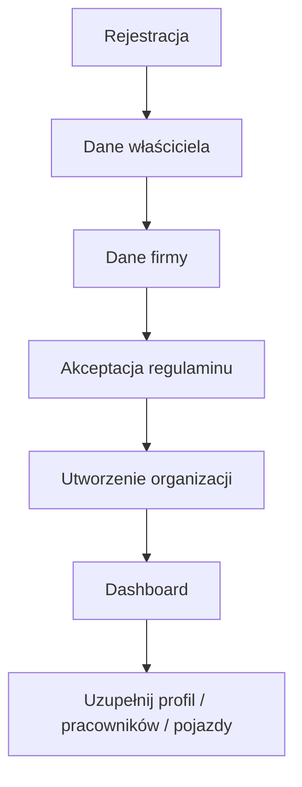
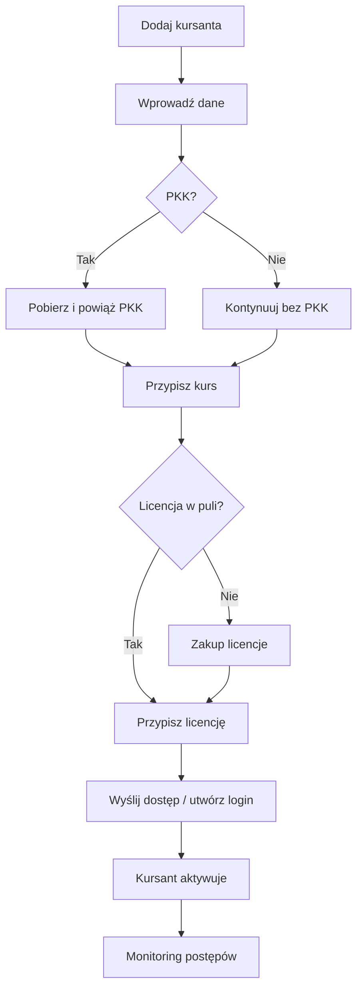
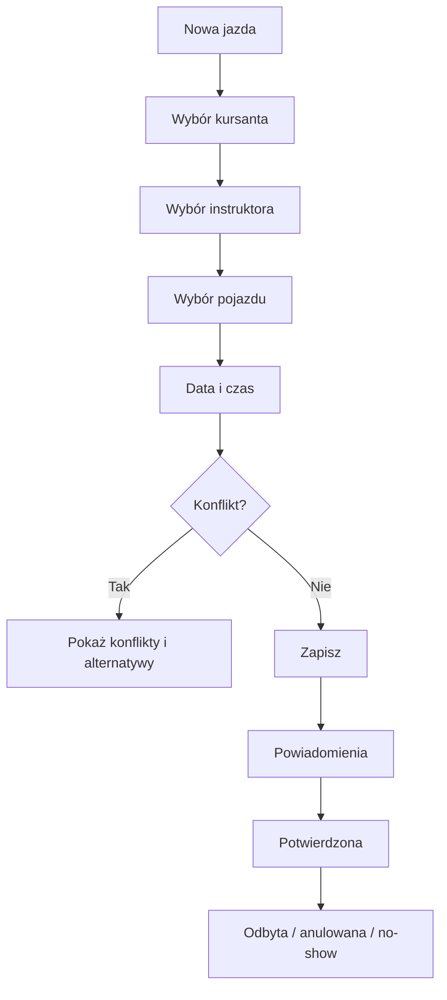

# 03. Główne przepływy użytkownika

## Flow A — założenie OSK

## Flow B — nowy kursant + licencja

## Flow C — cofnięcie nieaktywowanej licencji

1. OSK otwiera `Licencje > Zarządzaj`.
2. Filtruje status `przypisana / nieaktywna`.
3. Wybiera kursanta.
4. `Cofnij licencję`.
5. System potwierdza brak aktywacji.
6. Assignment zostaje anulowany.
7. Sztuka wraca do puli.
8. Operacja trafia do audytu.

## Flow D — egzamin wewnętrzny linkiem

1. OSK posiada dostępny egzamin w puli.
2. Wybiera kursanta i kategorię.
3. `Generuj egzamin`.
4. System tworzy jednorazowy token/link.
5. Link ma TTL i może być unieważniony przed startem.
6. Kursant uruchamia egzamin.
7. Po rozpoczęciu egzamin zostaje oznaczony `started`.
8. Po zakończeniu zapisujemy wynik i przebieg.
9. Egzamin staje się `consumed`.
10. Generowana jest karta przebiegu do PDF/drukowania.

## Flow E — egzamin stacjonarny

1. Sekretariat/instruktor wybiera kursanta.
2. `Rozpocznij egzamin stacjonarnie`.
3. System tworzy sesję na stanowisku egzaminacyjnym.
4. Po zakończeniu wynik jest zapisany.
5. Karta przebiegu dostępna cyfrowo i do druku.

## Flow F — jazda w kalendarzu

## Flow G — operacja PKK

Każda akcja zewnętrzna używa wzorca:

`request -> validation -> authorization -> audit_start -> external_call -> normalize_response -> persist -> audit_end -> notify`

Nie wolno wykonywać operacji PKK bez rekordu audytowego.

## Flow H — zakup

1. Użytkownik wybiera produkt (licencje / egzaminy / reklama).
2. Ustala ilość/wariant.
3. System liczy kwotę brutto/VAT.
4. Powstaje `Order`.
5. Użytkownik wybiera metodę płatności.
6. Dla operatora online czekamy na webhook.
7. Po potwierdzeniu powstaje `Payment` i odpowiedni inventory/entitlement.
8. Faktura/paragon zgodnie z konfiguracją księgową.
