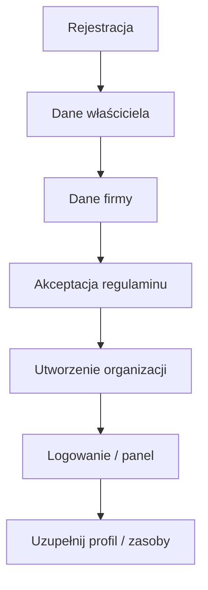
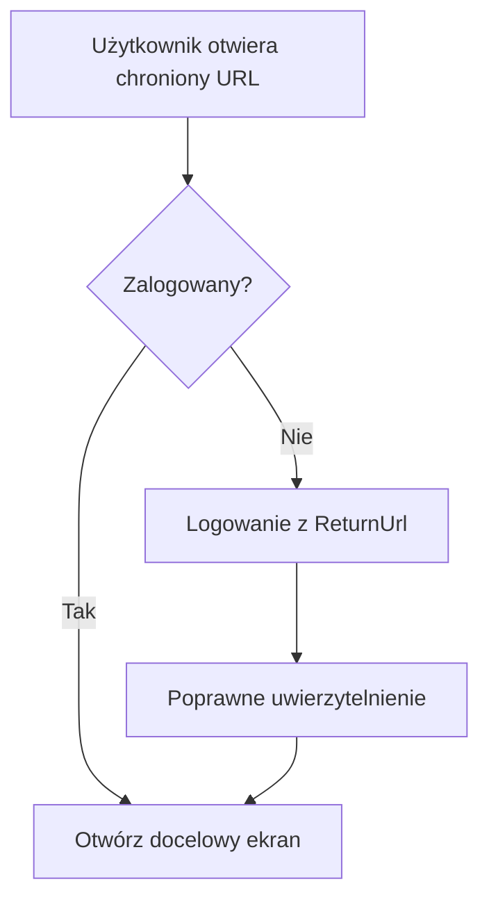
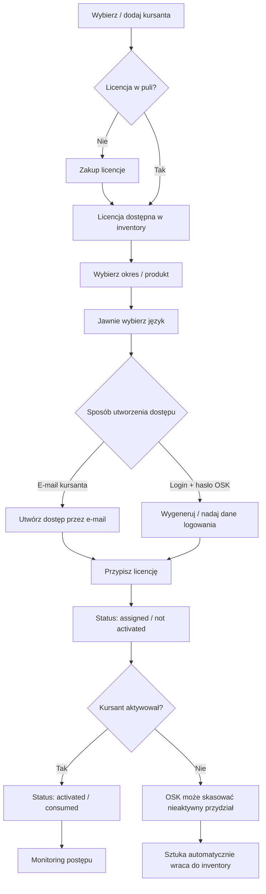
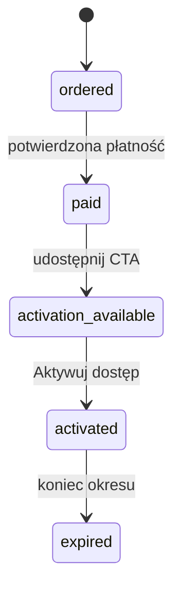
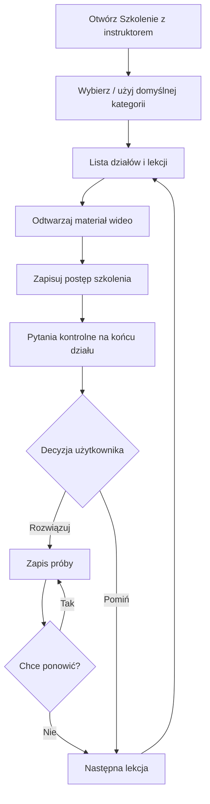
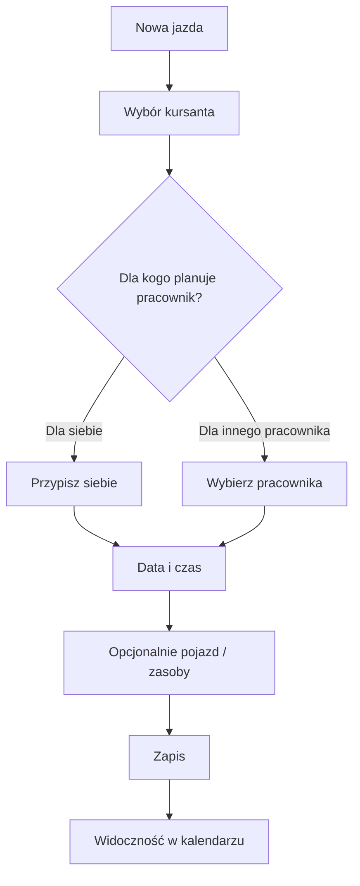
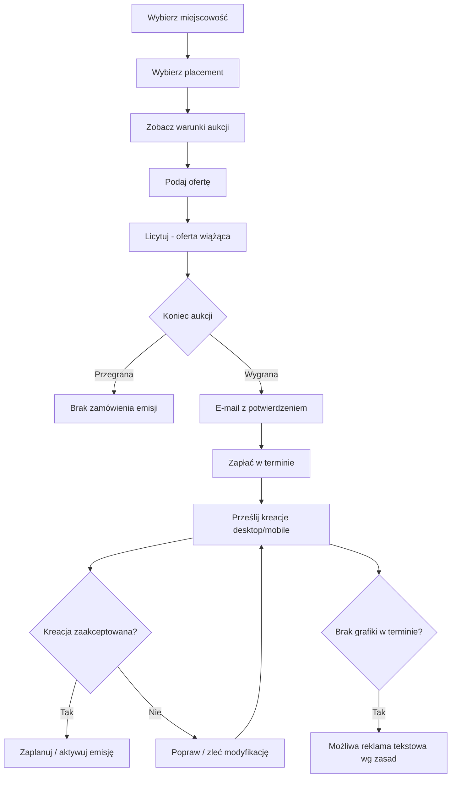

# 03. Główne przepływy użytkownika

> Stan po ponownej weryfikacji 2026-09-05. Tam, gdzie nie znamy dokładnego UI panelu, opisujemy potwierdzony rezultat biznesowy, a nie wymyślony przycisk.

## Flow A — założenie OSK

## Flow A2 — wejście na chronioną trasę

`ReturnUrl` jest obserwowalny na aktualnych chronionych trasach publicznie przekierowujących do logowania.

## Flow A3 — reset hasła

1. Użytkownik otwiera przypomnienie hasła.
2. Podaje **e-mail albo login**.
3. System inicjuje proces zmiany hasła i wysyła wiadomość zgodnie z aktualnym komunikatem strony.
4. Użytkownik może wrócić do logowania.

## Flow B — nowy kursant + licencja

### Reguły
- niewykorzystana sztuka w puli OSK i okres aktywnego pakietu użytkownika to dwa różne pojęcia,
- języka nie należy ustawiać „na sztywno” jako PL,
- obecna dokładna macierz języków zależy od modułu i wymaga konfiguracji.

## Flow C — cofnięcie nieaktywowanej licencji

1. OSK wybiera nieaktywowany przydział.
2. System potwierdza, że dostęp nie został aktywowany.
3. OSK usuwa/cofa przydział.
4. Assignment zostaje anulowany/skasowany.
5. Sztuka licencji **automatycznie wraca do puli**.
6. Operacja trafia do audytu własnego systemu.

Po aktywacji nie wolno stosować tego flow jako zwykłego „undo”.

## Flow D — zakup usługi cyfrowej z jawną aktywacją

1. Użytkownik wybiera produkt i wariant.
2. Powstaje zamówienie.
3. Użytkownik płaci online/kartą albo przelewem.
4. Po zaksięgowaniu płatności system może udostępnić `Aktywuj dostęp`.
5. Dopiero jawna aktywacja rozpoczyna dostęp dla produktów korzystających z tego mechanizmu.

Nie należy bezwarunkowo robić `payment_success == access_started`.

## Flow E — egzamin wewnętrzny linkiem

1. OSK posiada dostępny egzamin w puli.
2. Wybiera kursanta i wymagane parametry.
3. Generuje egzamin/link.
4. Kursant otwiera otrzymany link.
5. Po rozpoczęciu tworzona jest aktywna sesja egzaminu.
6. Po zakończeniu zapisujemy wynik/przebieg.
7. Egzamin zostaje wykorzystany.
8. Karta przebiegu może być przechowywana cyfrowo i drukowana.

Dokładne TTL tokena, możliwość unieważnienia linku i konfiguracja testu są `TO_VERIFY_AUTH`; nie należy ich przypisywać konkurencyjnemu systemowi bez dowodu.

## Flow F — egzamin stacjonarny

1. OSK wybiera funkcję stacjonarnego rozpoczęcia (`Rozpocznij egzamin wewnętrzny` jest potwierdzone regulaminem).
2. Uruchamia egzamin na stanowisku lokalnym.
3. Kursant wykonuje test.
4. System zapisuje wynik/przebieg.
5. Egzamin zostaje wykorzystany.
6. Karta przebiegu jest dostępna cyfrowo/do druku.

## Flow G — szkolenie z instruktorem

Zmiana kategorii konta może zmienić zawartość/strukturę szkolenia oraz domyślne filtrowanie testu, kursu i statystyk.

## Flow H — zmiana domyślnej kategorii

1. Użytkownik otwiera wybór kategorii.
2. Wybiera inną obsługiwaną kategorię.
3. System zapisuje `default_category` jako preferencję.
4. Test, kurs i statystyki automatycznie pokazują dane dla tej kategorii.
5. Moduł szkolenia ładuje odpowiednią treść dla wybranej kategorii.

Nie modelować tego jako jednorazowego, niezmiennego przypisania kategorii do użytkownika.

## Flow I — jazda w kalendarzu

Potwierdzone biznesowo są także:
- publikacja możliwości samodzielnego zapisu kursanta,
- podgląd aktywności instruktorów,
- ewidencja czasu pracy,
- dostęp do kalendarza w zależności od roli/uprawnień, w tym biuro i kadry/HR.

Konflikty zasobów i szczegółowe statusy to wymagania naszego systemu, a nie publicznie potwierdzony model 360.

## Flow J — operacja PKK

Każda własna integracja powinna używać wzorca:

`request -> validation -> authorization -> audit_start -> external_call -> normalize_response -> persist -> audit_end -> notify`

Potwierdzone rodzaje operacji biznesowych:
- pobierz profil,
- pokaż szczegóły,
- aktualizuj szkolenie,
- zwróć do innego OSK,
- zwróć do urzędu,
- zwróć profil przedawniony,
- pokaż historię operacji.

## Flow K — licytacja reklamy

### Dodatkowe akcje aukcji
- obejrzenie historii ofert,
- wniosek o ukrycie nazwy OSK w historii,
- prośba do operatora o odrzucenie własnej wiążącej oferty,
- przy remisie ofert decyduje wcześniejsze złożenie,
- emisja wymaga płatności.

## Flow L — artykuł sponsorowany

1. Klient zamawia usługę.
2. Wybiera: własna treść do redakcji albo przygotowanie tekstu przez operatora.
3. Przekazuje treść i materiały graficzne.
4. Materiał przechodzi moderację/redakcję.
5. Po akceptacji zostaje opublikowany i czasowo promowany.
6. Po zakończeniu okresu promocji może pozostać w archiwum aktualności.

## Flow M — ranking/opinia

1. Użytkownik wystawia ocenę 1–5 i/lub opinię zgodnie z zasadami serwisu.
2. Treść podlega moderacji.
3. Oceny, ich liczba i aktualność wpływają na ranking; mechanizm opisuje uśrednianie bayesowskie i okresowe przeliczenie.
4. OSK może zgłosić opinię do ponownej analizy administratora.
5. Organicznej pozycji rankingu nie traktujemy jako kupowalnej reklamy.

## Flow N — zamknięcie / blokada konta

- użytkownik może złożyć żądanie zamknięcia konta,
- operator może blokować konto/adresy przy naruszeniach,
- dla opłaconych kont użytkowników regulamin opisuje pojedynczą aktywną sesję; nowa sesja kończy poprzednią,
- szczegółowe skutki dla kont personelu OSK: `TO_VERIFY_AUTH`.
