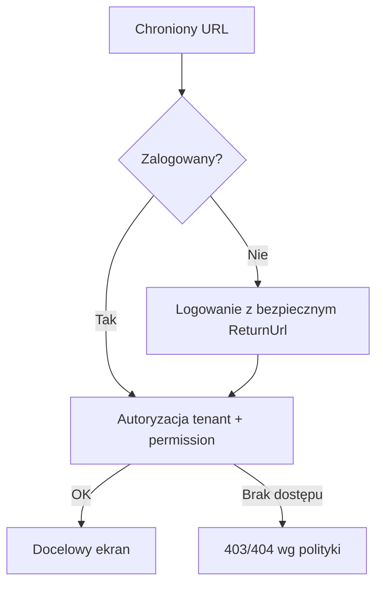
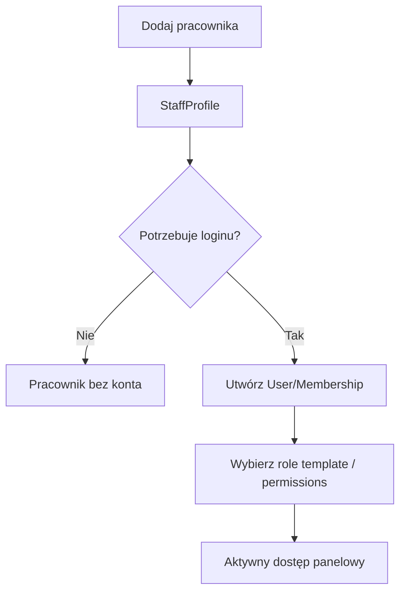
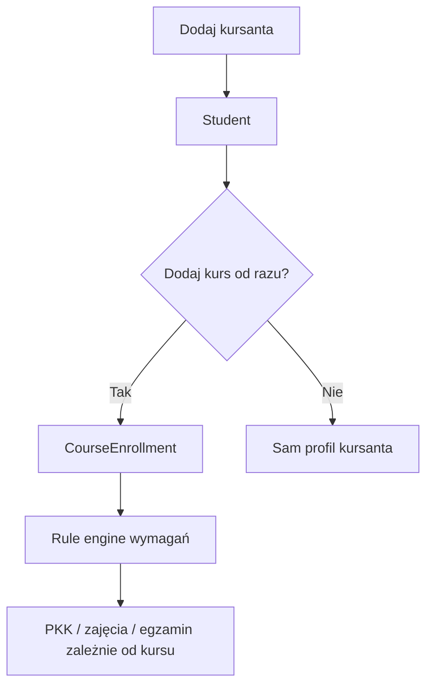
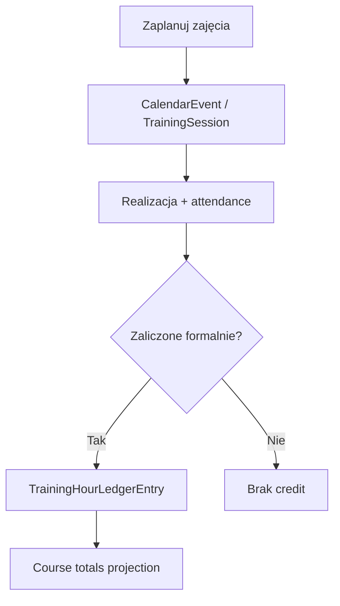
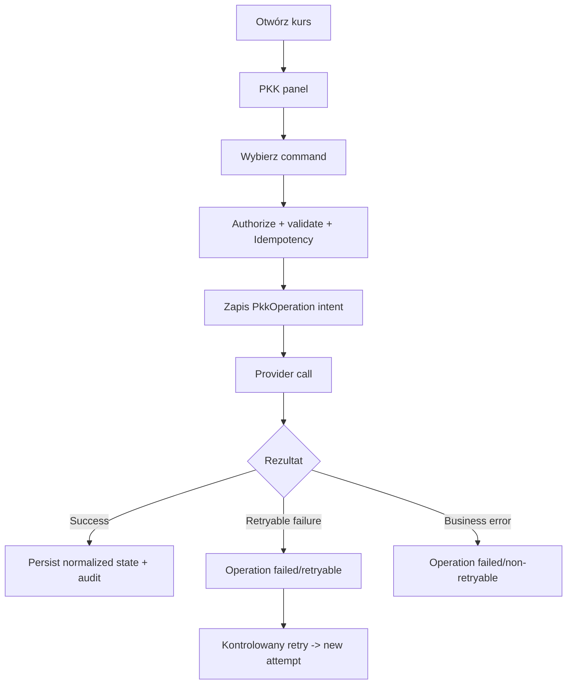
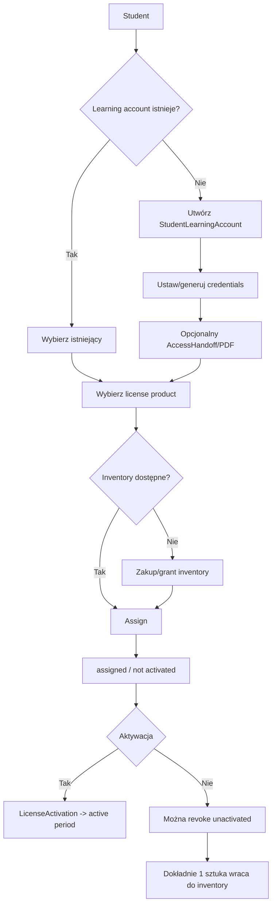
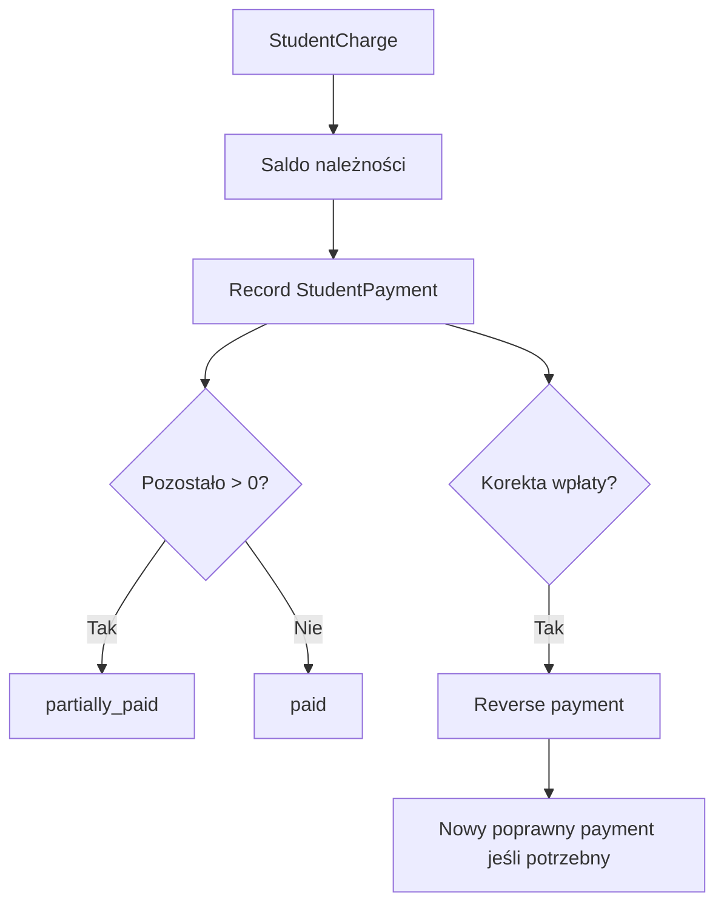
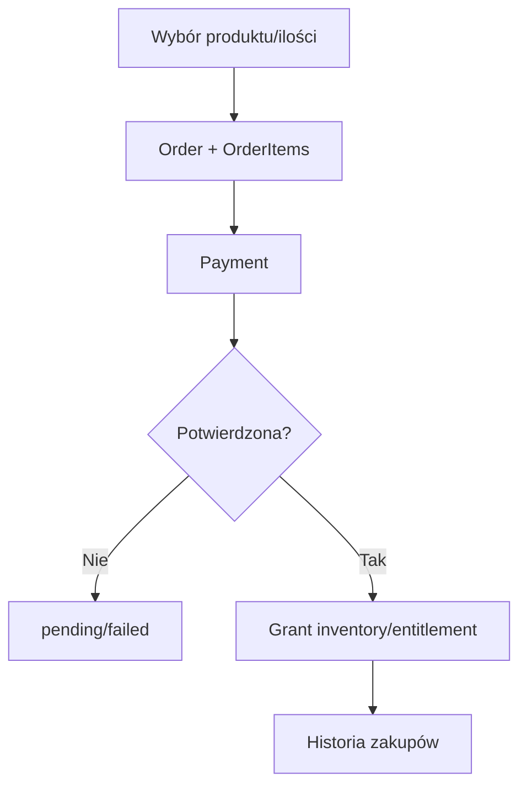
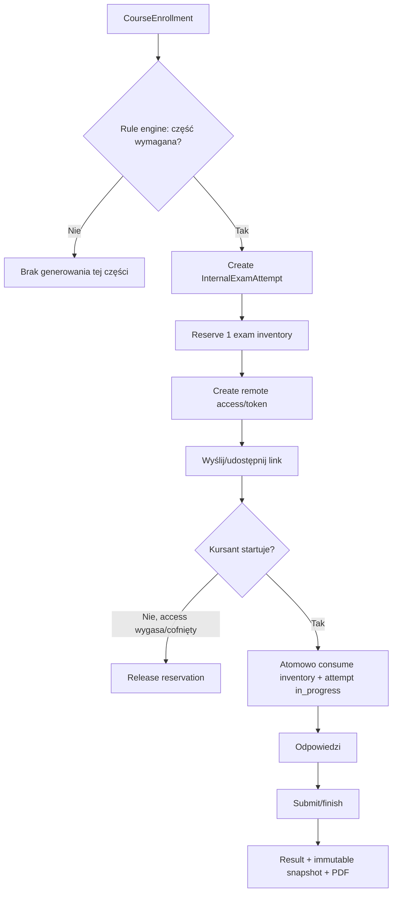

# 03. Główne przepływy użytkownika — core OSK v1

Data konsolidacji: 2026-09-05

> Szczegóły ekranowe są w `specs/screens/*.yml`. Ten dokument opisuje przepływy biznesowe naszego produktu. Canonical lifecycle egzaminu: `specs/design/internal-exam-lifecycle.yml`.

---

# Flow A — wejście do panelu

ReturnUrl przyjmuje wyłącznie lokalne/dozwolone ścieżki.

---

# Flow B — nowy pracownik

`staff_type` nie nadaje automatycznie permissions.

---

# Flow C — nowy kursant

Student może istnieć bez learning account i bez licencji.

---

# Flow D — dodanie formalnego kursu

1. Otwórz kursanta.
2. `Dodaj kurs`.
3. Wybierz rodzaj szkolenia i kategorię.
4. Podaj PKK, datę rozpoczęcia, instruktora i opcjonalną lokalizację.
5. Podaj/uznaj dane wejściowe dotyczące wcześniejszego szkolenia, jeżeli dotyczą.
6. Backend tworzy `CourseEnrollment`.
7. Rule engine zapisuje `TrainingRequirementProfile`.
8. Jeżeli podano koszt, StudentFinance może utworzyć powiązaną należność zgodnie z polityką produktu.

Pola godzin widoczne w audytowanym formularzu nie oznaczają, że ręczny agregat ma być source of truth w naszym systemie.

---

# Flow E — ewidencja zajęć i godzin

Dla czasu uznanego z innego OSK:

`RecognizedExternalTraining -> course totals projection`

Teoria: 45 min / godzina szkoleniowa.  
Praktyka: 60 min / godzina szkoleniowa.

---

# Flow F — zmiana podstawy zwolnienia / wymagań

1. Użytkownik zmienia fakty wejściowe lub podstawę zwolnienia.
2. System zapisuje actor/reason/evidence.
3. Rule engine przelicza requirement profile.
4. Wykonane wcześniej zajęcia nie są niszczone.
5. Przyszłe wymagania są aktualizowane.
6. Closed course wymaga correction mode.

Nie ma dowolnego checkboxa „zwolnij z teorii” omijającego reguły.

---

# Flow G — PKK

Operacja zawsze w kontekście kursu:

`Student -> CourseEnrollment -> PKK`

Historia nie miesza operacji kilku kursów tego samego kursanta.

---

# Flow H — learning account + licencja

Hasło jawne może być pokazane jednorazowo w handoff flow, ale nie jest później odzyskiwalne.

---

# Flow I — student finance

Płatności kursanta nie są zakupami OSK na platformie.

---

# Flow J — kalendarz / jazda

1. Użytkownik otwiera kalendarz.
2. Tworzy `Wydarzenie` albo `Jazdę`.
3. Wybiera datę/czas/duration.
4. Opcjonalnie wskazuje kursanta, instruktora, pojazd, lokalizację/miejsce własne.
5. Backend waliduje tenant oraz konflikty zasobów.
6. Zapis jest audytowany.
7. Późniejszy move/cancel działa według własnego lifecycle.

Self-booking używa atomowo rezerwowanych `AvailabilitySlot`.

---

# Flow K — zakup licencji/egzaminów przez OSK

Cena/VAT są snapshotowane na `OrderItem`.

---

# Flow L — egzamin wewnętrzny remote

**Inventory jest konsumowane przy start, nie przy finish.**

---

# Flow M — egzamin lokalny

1. Wybierz kursanta i `CourseEnrollment`.
2. Rule engine potwierdza wymaganą część.
3. Utwórz attempt/access i reservation.
4. Użytkownik uruchamia egzamin na stanowisku.
5. Start atomowo konsumuje inventory.
6. Kursant wykonuje egzamin.
7. Submit zapisuje wynik i snapshot.
8. PDF/dokument powstaje z historycznego snapshotu.

---

# Flow N — awaria egzaminu po starcie

1. Attempt jest już `in_progress`.
2. Występuje awaria techniczna.
3. Attempt -> `technical_abort`.
4. Inventory pozostaje consumed.
5. Jeżeli biznes decyduje o zwrocie sztuki, uprawniony użytkownik tworzy audytowaną compensating adjustment.

Brak automatycznego „oddania sztuki” po zamknięciu przeglądarki.

---

# Flow O — archiwizacja zasobu

Dla student/staff/location/vehicle:

1. sprawdź permission,
2. sprawdź aktywne zależności,
3. pokaż konsekwencje,
4. ustaw archived state,
5. zablokuj nowe przypisania,
6. zachowaj historię,
7. rozwiąż przyszłe wydarzenia jawnie,
8. audit.

Szczegóły: `docs/83-core-lifecycle-policy.md`.

---

# Flow P — dashboard

Dashboard jest projekcją, nie source of truth.

Agreguje:
- licencje,
- egzaminy,
- activity feed,
- kalendarz.

Kliknięcia prowadzą do właściwych bounded contexts; dashboard nie implementuje duplikatu ich logiki.
