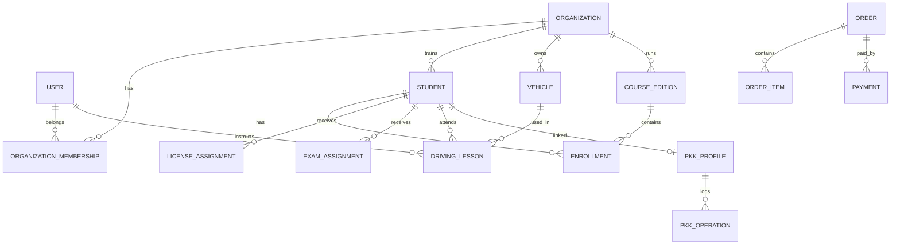

# 05. Model domenowy

## Główne encje

### Tenant i użytkownicy
- `organizations`
- `users`
- `organization_memberships`
- `roles`
- `permissions`
- `consents`
- `auth_identities`
- `sessions`

### OSK
- `school_profiles`
- `staff_profiles`
- `vehicles`
- `vehicle_documents`
- `reminders`

### Kursanci i szkolenie
- `students`
- `student_accounts`
- `courses`
- `course_editions`
- `enrollments`
- `lectures`
- `lecture_assignments`
- `learning_progress`
- `question_stats`

### Kalendarz
- `calendar_events`
- `driving_lessons`
- `availability_slots`
- `event_participants`
- `event_change_logs`

### PKK
- `pkk_profiles`
- `pkk_operations`
- `pkk_operation_attempts`

### Licencje
- `license_products`
- `license_inventory`
- `license_assignments`
- `license_activations`

### Egzaminy
- `exam_products`
- `exam_inventory`
- `internal_exams`
- `exam_assignments`
- `exam_sessions`
- `exam_answers`
- `exam_results`
- `exam_cards`

### Finanse
- `orders`
- `order_items`
- `payments`
- `payment_events`
- `invoices`
- `refunds`

### Ranking i reklama
- `school_public_profiles`
- `reviews`
- `review_moderations`
- `ad_campaigns`
- `ad_creatives`
- `ad_placements`
- `ad_regions`
- `ad_bids`

### Audyt
- `audit_logs`
- `notifications`
- `integration_logs`

## Kluczowe relacje

## Multi-tenancy

Każda encja biznesowa OSK ma `organization_id`. Dodatkowo:
- global scopes w Eloquent są pomocnicze, ale nie mogą być jedyną ochroną,
- Policy/Gate weryfikuje membership,
- testy integracyjne muszą sprawdzać, że tenant A nie odczyta tenant B po ręcznej zmianie ID.
