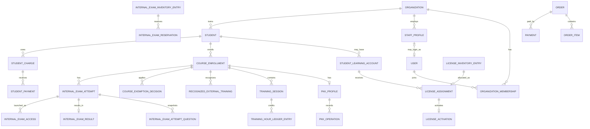

# 05. Model domenowy — core OSK v1

Data konsolidacji: 2026-09-05

> Canonical naming znajduje się w `docs/82-canonical-domain-glossary.md`. Jeżeli starszy dokument używa innej nazwy dla tego samego pojęcia, nowa implementacja używa nazw canonical.

## Zasady nadrzędne

1. System jest multi-tenant po `organization_id`.
2. Formalny przebieg jest **course-first**:
   `Organization -> Student -> CourseEnrollment -> Training/PKK/InternalExam`.
3. `Student` nie jest kontem logowania.
4. PKK należy do konkretnego `CourseEnrollment`, nie do całego `Student` jako jedynego ownera.
5. Godziny bieżącego OSK wynikają z ewidencji zajęć/ledgera.
6. Godziny uznane z innego OSK są osobnymi audytowalnymi rekordami.
7. Płatności kursanta za szkolenie są oddzielone od zakupów OSK na platformie.
8. Formalna i finansowa historia nie jest hard-delete.

---

# 1. Identity / tenant

Canonical encje:
- `organizations`
- `users`
- `organization_memberships`
- `roles`
- `permissions`
- `consents`
- `auth_identities`
- `sessions`
- `account_closure_requests`
- `account_blocks`

`organization_membership` jest technicznym połączeniem użytkownika z tenantem i jego permissions.

Nie zakładamy, że `staff_type` = role/permission.

---

# 2. Pracownicy OSK

Canonical encje:
- `staff_profiles`
- `staff_types`
- `staff_type_assignments`
- `staff_category_assignments`
- `staff_location_assignments`
- `staff_documents`
- `staff_user_links`

`StaffProfile` może istnieć bez konta do logowania.

Dopiero `staff_user_link` / membership wiąże pracownika z `User`.

Dokumenty pracownika mogą obejmować niezależne terminy, np.:
- legitymacja/uprawnienie,
- badanie lekarskie,
- badanie psychologiczne.

---

# 3. Kursanci i learning access

Canonical encje:
- `students`
- `student_learning_accounts`
- `student_access_handoffs`

`Student` przechowuje formalną kartotekę osoby szkolonej w OSK.

`StudentLearningAccount` przechowuje kontekst dostępu do produktu edukacyjnego, m.in.:
- identyfikator logowania/e-mail,
- język,
- link do identity/auth,
- status.

Hasła nie są przechowywane w plaintext ani w odwracalnej formie.

`StudentAccessHandoff` zapisuje fakt wygenerowania/przekazania PDF/danych dostępowych bez utrwalania starego jawnego hasła.

---

# 4. Formalny kurs / CourseEnrollment

Canonical encje:
- `course_enrollments`
- `training_requirement_profiles`
- `course_exemption_decisions`
- `recognized_external_training`
- `training_sessions`
- `training_session_attendance`
- `training_hour_ledger_entries`
- `training_completion_records`

`CourseEnrollment` oznacza **konkretne formalne szkolenie konkretnego kursanta**.

Minimalnie zawiera:
- `organization_id`,
- `student_id`,
- `training_type`,
- `driving_category_id`,
- `started_at`,
- `lead_instructor_id`,
- `location_id nullable`,
- `training_stage`,
- `requirements_profile_id`,
- `completed_at nullable`,
- `interrupted_at nullable`,
- `created_by_user_id`.

## 4.1. Etap szkolenia

Etap szkolenia jest stanem `CourseEnrollment`, niezależnym od:
- licencji,
- aktywacji konta edukacyjnego,
- egzaminu,
- płatności.

Potwierdzone UI etapy mogą być odwzorowane jako dictionary/config, np.:
- `unassigned`,
- `theory`,
- `practice`,
- `documentation`,
- `word_exam`,
- `supplementary_training`,
- `training_completed`.

Nie zakładamy, że kolejność/warunki przejść są tylko frontendowym selectem — backend musi walidować reguły formalne i biznesowe.

## 4.2. Source of truth godzin

### Bieżący OSK

Źródłem prawdy jest:

`TrainingSession -> attendance -> TrainingHourLedgerEntry -> projection totals`

`TrainingSession` zawiera co najmniej:
- `organization_id`,
- `course_enrollment_id`,
- `session_type`,
- `starts_at`,
- `ends_at` lub `duration_minutes`,
- `instructor_id`,
- `vehicle_id nullable`,
- `location_id nullable`,
- status/attendance,
- źródło i actor.

`TrainingHourLedgerEntry` jest audytowalnym księgowaniem czasu formalnie zaliczanego.

### Szkolenie z innego OSK

Nie zapisujemy tego jako zwykłego ręcznego nadpisania bieżącego licznika.

Używamy `RecognizedExternalTraining` z polami typu:
- `course_enrollment_id`,
- `training_part`,
- `recognized_minutes`,
- `source_school_reference nullable`,
- `evidence_reference nullable`,
- `reason`,
- `approved_by_user_id`,
- `approved_at`.

### Konwersja godzin

- teoria: 1 godzina = 45 minut,
- praktyka: 1 godzina = 60 minut.

Przechowujemy minuty jako canonical amount czasu. UI może prezentować godziny szkoleniowe.

## 4.3. Rule engine wymagań

`training_requirement_profiles` + wersjonowany rule engine wylicza:
- `theory_training_required`,
- `minimum_theory_minutes`,
- `internal_theory_exam_required`,
- `practical_training_required`,
- `minimum_practical_minutes`,
- `internal_practical_exam_required`,
- `exemption_basis_code`.

`course_exemption_decisions` przechowuje podstawę, dowód, actor, timestamp i wersję reguły.

Manual override nie może służyć dowolnemu obniżaniu ustawowych minimów. Może korygować fakty/podstawę prawną i wymaga audytu.

Szczegóły:
- `docs/66-formal-student-record-and-theory-exemptions.md`,
- `docs/67-editable-training-requirements-and-theory-exemption.md`,
- `specs/legal/*.yml`.

---

# 5. PKK

Canonical encje lokalnej identity i provider-neutralnego substrate:
- `pkk_profiles` — zaszyfrowana, wersjonowana identity PKK dla konkretnego `CourseEnrollment`,
- `pkk_provider_profile_snapshots` — osobna append-only historia snapshotów providera,
- `pkk_operations`,
- `pkk_operation_attempts`,
- `pkk_integration_settings`.

## Kluczowa relacja

`CourseEnrollment ||--o| PkkProfile`

Jeden `Student` może mieć wiele `CourseEnrollment` w czasie, więc API i baza nie mogą zakładać jednego globalnego PKK na osobę. Bieżąca identity to dokładnie jeden profil z `superseded_at IS NULL`; zmiana PKK lub formalnego kontekstu tworzy kolejną rewizję zamiast nadpisywania historii.

W materializowanym Stage 4 substrate `PkkOperation` ma obowiązkowy `pkk_profile_id` i jest exact-bound do:
- `organization_id`,
- `course_enrollment_id`,
- konkretnej rewizji `pkk_profile_id`,
- typu commandu,
- actora,
- request/correlation id,
- statusu biznesowego i timestampów.

`PkkOperationAttempt` opisuje provider-neutralny transport/evidence dla konkretnej operacji. Te tabele i guardy są obecnie fail-closed substrate — **nie oznaczają aktywnej integracji z PWPW**.

Aktualny Core używa lokalnej identity PKK wprowadzanej ręcznie przy formalnym kursie. Provider-specific import, live calls, status mapping, podpis i reconciliation są `FROZEN_UNTIL_EXPLICIT_UNFREEZE` do czasu autorytatywnych wytycznych PWPW. Sekrety integracji nie są przechowywane w repo ani logowane w audit payloadach.

---

# 6. Kalendarz i zasoby

Canonical encje:
- `calendar_events`
- `driving_lessons`
- `availability_slots`
- `event_participants`
- `event_resources`
- `event_change_logs`
- `work_time_entries`

Zasoby powiązane:
- `staff_profiles`,
- `students`,
- `vehicles`,
- `locations`.

`CalendarEvent` ma canonical time model:
- `starts_at`,
- `duration_minutes`,
- `ends_at` wyliczane lub utrzymywane spójnie,
- timezone organizacji.

Konflikty zasobów sprawdza backend.

`Important dates` mogą być projekcją systemową z terminów dokumentów, a nie ręcznym `CalendarEvent`.

---

# 7. Lokalizacje

Canonical encje:
- `locations`

Potwierdzone typy startowe:
- `branch`,
- `lecture_room`,
- `maneuvering_area`.

Typy są dictionary/config, nie enum zamkniętym na zawsze.

Relacje:
- staff <-> locations,
- vehicles <-> locations,
- course_enrollment -> location nullable,
- calendar_event -> location nullable.

Archiwizacja nie usuwa historycznych referencji.

---

# 8. Pojazdy

Canonical encje:
- `vehicles`
- `vehicle_category_assignments`
- `vehicle_location_assignments`
- `vehicle_documents`
- `vehicle_assets`

Ważności dokumentów są niezależne, np.:
- badanie techniczne,
- OC,
- AC.

Nie używać daty sentinel `0001-01-01` jako realnej daty biznesowej.

---

# 9. Student finance

Canonical encje:
- `student_charges`
- `student_payments`

`StudentCharge` = należność kursanta wobec OSK.

`StudentPayment` = wpłata do należności.

Saldo jest projekcją:
`charge.original_amount - valid payments`.

Money przechowujemy jako minor units lub decimal, nigdy float.

Student finance NIE jest częścią `orders/payments` operatora platformy.

Spec: `specs/design/student-finance-ledger.yml`.

---

# 10. Licencje / learning entitlement

Canonical encje:
- `license_products`
- `license_inventory_entries`
- `license_assignments`
- `license_activations`
- `license_product_languages`

Rozróżnienie:
- inventory entry = jedna niewykorzystana sztuka OSK,
- assignment = przydział do learning account,
- activation = start wykorzystania,
- product duration = okres aktywnego dostępu.

Lifecycle:

`inventory -> assigned -> activated -> expired`

Odwracalna gałąź:

`assigned + not_activated -> revoked -> inventory`

Cofnięcie assignmentu musi być atomowe i przywraca dokładnie jedną sztukę.

---

# 11. Egzamin wewnętrzny

Canonical encje:
- `internal_exam_inventory_entries`
- `internal_exam_reservations`
- `internal_exam_accesses`
- `internal_exam_attempts`
- `internal_exam_attempt_questions`
- `internal_exam_results`
- `internal_exam_documents`
- `internal_practical_exam_sheets`
- `exam_stations`
- `exam_language_capabilities`

## Formalne powiązanie

`InternalExamAttempt` wymaga:
- `organization_id`,
- `student_id NOT NULL`,
- `course_enrollment_id NOT NULL`,
- `exam_part`,
- category snapshot,
- candidate snapshot,
- `requirement_basis`,
- actor/audit.

Nie obsługujemy formalnego `ad_hoc_candidate` bez trwałego kursanta i kursu.

## Inventory lifecycle core v1

Źródło prawdy: `specs/design/internal-exam-lifecycle.yml`.

Domyślnie:
- access creation -> reserve inventory,
- exam start -> consume inventory atomically,
- cancel/expire/revoke przed startem -> release reservation,
- technical abort po starcie nie zwraca automatycznie sztuki,
- przywrócenie po starcie tylko przez audytowaną korektę.

Attempt lifecycle jest oddzielny od inventory lifecycle.

---

# 12. Zakupy OSK na platformie

Canonical encje:
- `orders`
- `order_items`
- `payments`
- `payment_events`
- `service_entitlements`
- `service_activations`
- `transfer_confirmations`

Lifecycle entitlementu:

`ordered -> paid -> activation_available -> activated -> expired`

Dla `activation_mode=explicit` webhook płatności nie może automatycznie rozpocząć okresu usługi.

Historyczna zmiana ceny nie może zmieniać starego zamówienia; snapshot ceny/VAT należy do `order_item`.

## Faktury

`invoices` są opcjonalną funkcją własnego produktu. Nie są wymaganiem parytetu core v1.

## Refundy

`refunds` mogą istnieć jako własny proces finansowy; nie są dowodem potwierdzonego przycisku konkurenta.

---

# 13. Ranking / opinie / reklamy

Pozostają poza core implementacyjnym v1, ale zachowujemy model domenowy do późniejszego rozszerzenia.

Ranking/opinie:
- `school_public_profiles`
- `reviews`
- `review_moderations`
- `review_reports`
- `ranking_snapshots`
- `ranking_scores`

Reklamy:
- `ad_placements`
- `ad_regions`
- `ad_auctions`
- `ad_bids`
- `ad_bid_privacy_requests`
- `ad_bid_rejection_requests`
- `ad_orders`
- `ad_campaigns`
- `ad_creatives`
- `ad_creative_reviews`
- `ad_campaign_schedules`

Nie implementować ich jako dependency core OSK.

---

# 14. Audyt i komunikacja

Canonical encje:
- `audit_logs`
- `notifications`
- `integration_logs`
- `outbox_messages`
- `complaints`
- `contact_requests`

Krytyczne domenowe mutacje publikują event do outbox po tej samej transakcji DB.

---

# 15. Kluczowe relacje

---

# 16. Multi-tenancy

Każda encja należąca do OSK posiada lub dziedziczy jednoznaczny `organization_id`.

Wymagania:
- Policy/Gate na backendzie,
- global scope Eloquent jest pomocniczy, nie jedyny,
- publiczny UUID nie zastępuje autoryzacji,
- testy cross-tenant dla read/write,
- relacyjne ID z requestu zawsze weryfikowane względem organizacji.

---

# 17. Dane konfigurowalne zamiast hard-code

Jako config/dictionary/versioned rules:
- kategorie prawa jazdy,
- języki per produkt/moduł,
- training requirements,
- minimalne minuty per kategoria/tryb,
- staff types,
- location types,
- license products/durations,
- exam capabilities,
- ceny/VAT,
- ad placement parameters.

Szczególny punkt do ujednolicenia w kolejnej partii: canonical code dla `PT` / pozwolenia na kierowanie tramwajem.
