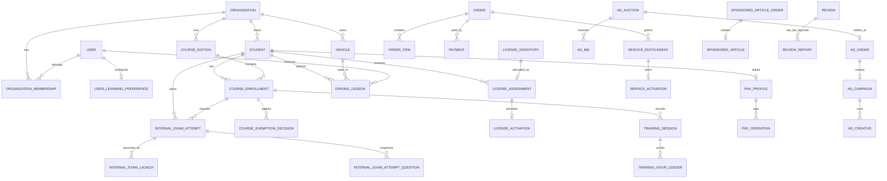

# 05. Model domenowy

> Model po drugiej weryfikacji funkcji publicznych i audycie formalnych wymagań OSK. Celem jest odwzorowanie zachowań biznesowych własną architekturą, bez kopiowania implementacji badanego serwisu.

## Główne encje

### Tenant i użytkownicy
- `organizations`
- `users`
- `organization_memberships`
- `roles`
- `permissions`
- `consents`
- `auth_identities`
- `sessions`
- `account_closure_requests`
- `account_blocks`
- `user_learning_preferences`

`user_learning_preferences` powinno zawierać m.in. `default_driving_category_id`, ponieważ kategoria może być przełączana i wpływać na test/kurs/statystyki/szkolenie.

### OSK
- `school_profiles`
- `staff_profiles`
- `vehicles`
- `vehicle_documents`
- `reminders`
- `work_time_entries`

### Kursanci i formalne szkolenie
- `students`
- `student_accounts`
- `student_access_credentials`
- `courses`
- `course_editions`
- `course_enrollments`
- `course_requirement_profiles`
- `course_exemption_decisions`
- `training_sessions`
- `training_session_attendance`
- `training_hour_ledger`
- `training_completion_records`
- `lectures`
- `lecture_assignments`
- `training_programs`
- `training_sections`
- `training_lessons`
- `training_control_question_sets`
- `training_control_attempts`
- `learning_progress`
- `question_stats`

`student_access_credentials` musi obsłużyć co najmniej dwa kanały: `email_account` oraz `osk_generated_credentials`. Hasła nigdy nie są przechowywane w plaintext.

#### Formalna ewidencja osoby szkolonej

Dla formalnego kursu OSK `student` nie jest opcjonalnym CRM-em. Jest trwałym rekordem osoby szkolonej, na którym opiera się dokumentacja kursu.

Relacja źródłowa:

`organization -> student -> course_enrollment -> training_sessions -> training_hour_ledger -> completion/internal exams`

Formalny `course_enrollment` powinien zawierać co najmniej:
- kategorię,
- rodzaj szkolenia (`basic` / `supplementary`),
- PKK / identyfikację formalną,
- instruktora prowadzącego,
- datę rozpoczęcia,
- stan szkolenia,
- podstawę ewentualnego zwolnienia z teorii,
- wymaganą i wykonaną teorię/praktykę,
- datę zakończenia albo przerwania.

#### Sesje i godziny szkolenia

Nie przechowujemy tylko ręcznej liczby `liczba_godzin` wpisanej na końcu kursu. Źródłem prawdy są sesje szkoleniowe.

`training_session` powinien zawierać m.in.:
- `organization_id`,
- `course_enrollment_id`,
- `session_type = theory | practical | first_aid | other`,
- `started_at`,
- `ended_at`,
- `instructor_id`,
- `vehicle_id nullable`,
- `location_id nullable`,
- potwierdzenie udziału / status,
- źródło wpisu i audyt.

`training_hour_ledger` jest niezmiennym księgowaniem formalnie zaliczanego czasu wyliczanego z sesji oraz dopuszczalnych korekt audytowych.

Dla reguł szkoleniowych:
- godzina teorii = 45 minut,
- godzina praktyki = 60 minut.

#### Rule engine wymagań kursu

Wymagania nie mogą być wyłącznie ręcznymi checkboxami administratora.

`course_requirement_profiles` + wersjonowany rule engine powinny wyliczać:
- `theory_training_required`,
- `minimum_theory_minutes`,
- `internal_theory_exam_required`,
- `practical_training_required`,
- `minimum_practical_minutes`,
- `internal_practical_exam_required`,
- `exemption_basis_code`.

`course_exemption_decisions` zapisuje:
- podstawę zwolnienia/uznania,
- dowód/odnośnik do uprawnienia lub wyniku,
- kto i kiedy zatwierdził,
- wersję reguły prawnej.

Przykładowo C+E po C nie wymaga teorii, ale nadal jest formalnym enrollmentem z wymaganym szkoleniem praktycznym i ewidencją godzin.

Pełny opis: `docs/66-formal-student-record-and-theory-exemptions.md` oraz `specs/legal/training-theory-exemptions.yml`.

### Kalendarz
- `calendar_events`
- `driving_lessons`
- `availability_slots`
- `event_participants`
- `event_resources`
- `event_change_logs`
- `work_time_entries`

### PKK
- `pkk_profiles`
- `pkk_operations`
- `pkk_operation_attempts`

### Licencje
- `license_products`
- `license_inventory`
- `license_assignments`
- `license_activations`
- `license_languages` / relacja produkt-język

#### Rozróżnienie krytyczne
- `license_inventory` = niewykorzystana sztuka należąca do OSK,
- `license_assignment` = przydzielenie konkretnej sztuki,
- `license_activation` = moment nieodwracalnego rozpoczęcia wykorzystania,
- `license_product.duration` = okres aktywnego dostępu, a nie termin ważności niewykorzystanej sztuki inventory.

Stan:
`inventory -> assigned -> activated/consumed -> expired`

Odwracalnie tylko przed aktywacją:
`assigned + not_activated -> revoked/deleted -> inventory`.

### Egzaminy wewnętrzne
- `exam_products`
- `exam_inventory`
- `internal_exam_attempts`
- `internal_exam_attempt_questions`
- `internal_exam_launches`
- `internal_exam_launch_tokens`
- `internal_exam_results`
- `internal_exam_documents`
- `internal_practical_exam_sheets`
- `exam_language_capabilities`

Nie hardkodować globalnej listy języków. Dostępność języka powinna należeć do produktu/modułu i być wersjonowalna.

#### Formalne powiązanie egzaminu z kursem

Formalny `internal_exam_attempt` nie może być niezależnym egzaminem osoby spoza ewidencji OSK.

Wymagane:
- `student_id NOT NULL`,
- `course_enrollment_id NOT NULL`,
- `organization_id`,
- `exam_part = theory | practical`,
- kategoria i dane kandydata w snapshotach,
- `requirement_basis` / podstawa tego, że dana część jest wymagana,
- audyt operatora.

Nie dopuszczamy własnego `ad_hoc_candidate` dla formalnego egzaminu OSK. Szybka akcja „Dodaj kursanta” w flow egzaminu może istnieć, ale najpierw tworzy trwałego `student` i formalny `course_enrollment`.

Przed generowaniem teoretycznego egzaminu system pyta rule engine, czy `internal_theory_exam_required = true`.

`internal_exam_launch` opisuje sposób dostarczenia jednej próby:
- `remote_link`,
- `local_station`.

Launch nie jest osobnym egzaminem i nie zastępuje `internal_exam_attempt`.

### Zamówienia, płatności i aktywacja usługi
- `orders`
- `order_items`
- `payments`
- `payment_events`
- `service_entitlements`
- `service_activations`
- `transfer_confirmations`

#### Lifecycle entitlement
`ordered -> paid -> activation_available -> activated -> expired`

Nie każdy produkt musi używać ręcznej aktywacji, dlatego `activation_mode = automatic | explicit` powinno należeć do konfiguracji produktu.

### Faktury / refundy
- `invoices` — **opcjonalna encja naszego produktu**, ponieważ faktury były `HISTORICAL_INDEX`, ale stara trasa obecnie nie potwierdza bieżącego modułu,
- `refunds` — encja projektowa procesu finansowego, nie dowód istnienia panelowego przycisku refund w 360.

### Ranking i opinie
- `school_public_profiles`
- `reviews`
- `review_moderations`
- `review_reports`
- `ranking_snapshots`
- `ranking_scores`

`ranking_scores` powinno pozwalać przechowywać wersjonowany wynik/agregat zamiast przeliczać historyczne rankingi z aktualnego algorytmu.

### Reklamy / aukcje
- `ad_placements`
- `ad_regions`
- `ad_auctions`
- `ad_bids`
- `ad_bid_privacy_requests`
- `ad_bid_rejection_requests`
- `ad_orders`
- `ad_campaigns`
- `ad_creatives`
- `ad_creative_reviews`
- `ad_campaign_schedules`

#### Stany aukcji
`scheduled -> open -> closed -> settled`

#### Stany zwycięskiej kampanii
`won -> awaiting_payment -> awaiting_creative -> creative_review -> ready -> active -> completed`

Dodatkowe gałęzie:
- `creative_rejected -> awaiting_creative`,
- `creative_missing -> text_fallback` jeśli produkt/reguły na to pozwalają,
- brak emisji przed spełnieniem wymogu płatności.

### Artykuły sponsorowane
- `sponsored_article_orders`
- `sponsored_articles`
- `sponsored_article_assets`
- `sponsored_article_reviews`
- `sponsored_article_publications`

Stan:
`ordered -> content_pending -> editorial_review -> approved -> promoted -> archived`.

### Partner banner / usługi handlowe
- `partner_banner_assets`
- `implementation_help_requests`
- `commercial_service_leads`

### Audyt i komunikacja
- `audit_logs`
- `notifications`
- `integration_logs`
- `complaints`
- `contact_requests`

## Kluczowe relacje

## Multi-tenancy

Każda encja biznesowa OSK ma `organization_id` tam, gdzie zasób należy do OSK. Dodatkowo:
- global scopes w Eloquent są pomocnicze, ale nie mogą być jedyną ochroną,
- Policy/Gate weryfikuje membership i permission,
- identyfikatory publiczne nie zastępują autoryzacji,
- testy integracyjne muszą sprawdzać, że tenant A nie odczyta ani nie zmieni tenant B po ręcznej zmianie ID,
- aukcje/placementy/ranking mogą być zasobami globalnymi operatora, ale bid/order/campaign muszą być jednoznacznie przypisane do tenant/organization.

## Dane konfigurowalne zamiast hard-code

Ze względu na rozbieżności w publicznych źródłach oraz zmiany prawne jako dane/CMS/config przechowywać:
- języki dostępne dla każdego produktu/modułu,
- kategorie prawa jazdy,
- wersjonowane reguły wymagań szkolenia i zwolnień,
- minimalne czasy szkolenia per kategoria/tryb,
- liczbę sekcji/lekcji szkolenia,
- okresy pakietów,
- parametry placementów reklamowych,
- czas ekspozycji reklamy pełnoekranowej,
- parametry aukcji,
- teksty i limity produktów handlowych.
